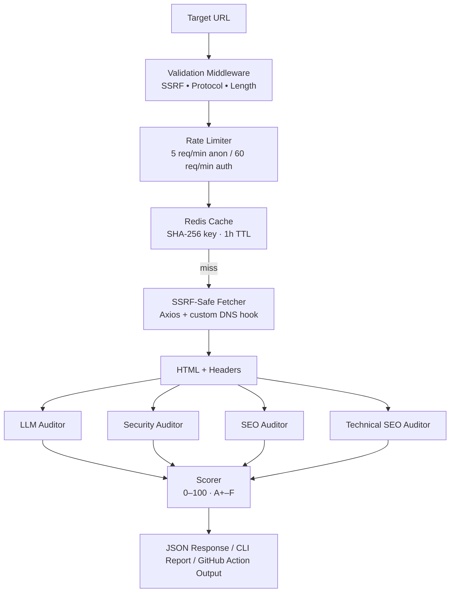

# ⚡ AutoNode Pulse

> A production-grade Architectural Auditing & LLM-Readiness scanner — runs as a REST API, a global CLI, or a GitHub Actions quality gate.

[](https://github.com/AutoNode-Labs/autonode-pulse/actions/workflows/self-audit.yml)
[](https://nodejs.org)
[](LICENSE)

---

## What It Does

AutoNode Pulse fetches any public URL and returns a 0–100 **Pulse Score** across four auditing dimensions:

| Category | Max Score | What It Checks |
|---|---|---|
| **LLM & RAG Readiness** | 30 pts | `robots.txt` AI crawler policy, 8 major bots, semantic HTML5 structure |
| **Infrastructure Security** | 35 pts | 6 required security headers, 4 information-leak headers |
| **Enterprise SEO** | 35 pts | Title, meta description, Open Graph, image alt coverage, JSON-LD |
| **Technical SEO** | 15 pts | `sitemap.xml`, canonical tag, hreflang / x-default |

**Total: 115 raw points → normalized to 0–100.** Grade scale: A+ → A → B+ → B → C → D → F.

---

## Architecture



SSRF defense runs at two layers:
1. **Validation middleware** — blocks literal private/loopback IPs before any network call.
2. **DNS lookup hook** — blocks hostnames that resolve to private IPs (including post-redirect).

---

## Quick Start

### REST API

```bash
# Install dependencies
npm ci

# Start the server (default port 3000)
npm start

# Audit a URL
curl -X POST http://localhost:3000/api/v1/audit \
  -H "Content-Type: application/json" \
  -d '{"targetUrl": "https://example.com"}'
```

### CLI

```bash
# Install globally
npm link

# Run an audit
autonode-pulse https://example.com

# Set a minimum score threshold (exit 1 if below)
autonode-pulse https://example.com --threshold 80

# JSON output for scripting
autonode-pulse https://example.com --json | jq '.pulseScore.overall'
```

### GitHub Actions

```yaml
- name: Audit deployed site
  id: pulse
  uses: AutoNode-Labs/autonode-pulse@main
  with:
    url: 'https://your-site.com'
    threshold: '75'

- name: Block merge if audit fails
  if: steps.pulse.outputs.passed == 'false'
  run: |
    echo "::error::Score ${{ steps.pulse.outputs.score }}/100 is below threshold 75"
    exit 1
```

---

## API Reference

### `POST /api/v1/audit`

Synchronous audit. Blocks until complete; returns full scorecard. Cached for 1 hour per URL.

**Request**
```json
{
  "targetUrl": "https://example.com"
}
```

Add `?fresh=true` to bypass the cache and force a new audit.

**Response `200 OK`**
```json
{
  "success": true,
  "targetUrl": "https://example.com",
  "finalUrl": "https://www.example.com/",
  "httpStatus": 200,
  "auditedAt": "2026-05-24T10:00:00.000Z",
  "pulseScore": {
    "overall": 88,
    "grade": "A-",
    "breakdown": {
      "llmReadiness":  { "score": 22, "maxScore": 30, "percentage": 73 },
      "security":      { "score": 33, "maxScore": 35, "percentage": 94 },
      "enterpriseSeo": { "score": 31, "maxScore": 35, "percentage": 89 },
      "technicalSeo":  { "score": 15, "maxScore": 15, "percentage": 100 }
    }
  },
  "categories": {
    "llmReadiness": { ... },
    "security":     { ... },
    "enterpriseSeo":{ ... },
    "technicalSeo": { ... }
  }
}
```

### `POST /api/v1/audit/async`

Enqueues an audit and returns a `jobId` immediately (`202 Accepted`). Optionally delivers the result to a webhook.

**Request**
```json
{
  "targetUrl": "https://example.com",
  "webhookUrl": "https://your-server.com/webhook"
}
```

**Response `202 Accepted`**
```json
{
  "success": true,
  "jobId": "a1b2c3d4-...",
  "status": "queued",
  "statusUrl": "/api/v1/audit/jobs/a1b2c3d4-..."
}
```

### `GET /api/v1/audit/jobs/:id`

Polls an async audit job. Returns `status: queued | processing | completed | failed`.

### `GET /health`

```json
{ "status": "ok", "service": "autonode-pulse", "version": "2.0.0" }
```

---

### Error Codes

| HTTP | Code | When |
|---|---|---|
| 400 | `VALIDATION_ERROR` | Missing or malformed `targetUrl` |
| 401 | `UNAUTHORIZED` | Missing `X-API-Key` when auth is required |
| 403 | `FORBIDDEN` | Invalid API key |
| 403 | `SSRF_BLOCKED` | URL resolves to a private/reserved IP |
| 404 | `JOB_NOT_FOUND` | Unknown job ID |
| 429 | `RATE_LIMITED` | Too many requests |
| 502 | `FETCH_ERROR` | Target unreachable or network error |
| 504 | `FETCH_TIMEOUT` | Target did not respond within 15 seconds |

---

## CLI Reference

```
Usage: autonode-pulse <url> [options]

Arguments:
  url                     Target URL to audit (http:// or https://)

Options:
  -t, --threshold <n>     Minimum acceptable Pulse Score 0–100 (default: 70)
  --json                  Output raw JSON instead of the visual report
  -V, --version           Show version number
  -h, --help              Show help
```

**Exit codes:** `0` = passed (score ≥ threshold), `1` = failed or error.

The `--json` flag writes to `stdout`; progress output goes to `stderr`, keeping the pipe clean for `jq`.

---

## GitHub Actions

### Inputs

| Input | Required | Default | Description |
|---|---|---|---|
| `url` | Yes | — | Target URL to audit (must be `https://`) |
| `threshold` | No | `70` | Minimum Pulse Score. Pipeline fails if below. |

### Outputs

| Output | Description |
|---|---|
| `score` | Overall Pulse Score (0–100) |
| `grade` | Letter grade (`A+`, `A`, `B+` … `F`) |
| `passed` | `"true"` if score ≥ threshold, `"false"` otherwise |

### Example Workflows

**Post-deploy quality gate (Vercel / Netlify):**
```yaml
on:
  deployment_status:

jobs:
  audit:
    runs-on: ubuntu-latest
    if: github.event.deployment_status.state == 'success'
    steps:
      - uses: AutoNode-Labs/autonode-pulse@main
        with:
          url: 'https://your-site.com'
          threshold: '75'
```

**Weekly cron + Slack notification:** see [`.github/workflows/example-usage.yml`](.github/workflows/example-usage.yml).

---

## Configuration

All configuration is via environment variables.

| Variable | Default | Description |
|---|---|---|
| `PORT` | `3000` | HTTP server port |
| `ALLOWED_ORIGINS` | `http://localhost:3000,http://localhost:5173` | Comma-separated CORS origin whitelist |
| `REQUIRE_AUTH` | `false` | Set to `true` to enforce API key auth |
| `API_KEYS` | _(empty)_ | Comma-separated valid API keys |
| `REDIS_URL` | `redis://localhost:6379` | Redis connection string. Service degrades gracefully if Redis is unavailable. |

**API key authentication:** pass the key in the `X-API-Key` header. Authenticated clients get 60 req/min; anonymous clients get 5 req/min.

---

## Security Model

- **SSRF:** Two-layer defense — literal IP validation at middleware boundary + DNS lookup hook that intercepts resolution inside the HTTP agent (catches hostname aliases and redirect chains).
- **CORS:** Strict origin whitelist via `ALLOWED_ORIGINS`. No-origin requests (server-to-server, CLI, CI) always pass.
- **Rate limiting:** IP-based (anonymous) or API-key-based (authenticated). Two tiers: standard (sync) and stricter async limiter.
- **Helmet:** Full default security header suite applied on all responses.
- **Webhook SSRF:** Async webhook delivery URLs run through the same SSRF guard. Webhook must use HTTPS.
- **Body limit:** 50 KB maximum request body — prevents memory exhaustion via oversized payloads.

---

## Live Case Study

To demonstrate real-world impact, `autonode-pulse` was run against `https://aixsap.com` — an enterprise SAP & AI thought-leadership site.

**Before hardening — 68/100 (Grade: C+)**

| Category | Before | After | Status |
|---|---|---|---|
| Technical SEO | 15/15 (100%) | 15/15 (100%) | ✅ Unchanged — already optimal |
| Enterprise SEO | 32/35 (91%) | 32/35 (91%) | ✅ Unchanged — JSON-LD present; meta description slightly short |
| LLM Readiness | 21.5/30 (72%) | 21.5/30 (72%) | ⚠️ Unchanged — `GPTBot` / `CCBot` intentionally blocked by design |
| Infrastructure Security | 10/35 (29%) | 35/35 (100%) | ✅ Hardened — `X-Powered-By` stripped; HSTS, CSP (`frame-ancestors 'none'`), X-Frame-Options, Referrer-Policy, Permissions-Policy injected via Cloudflare Transform Rules |

**Remediation:** Cloudflare Transform Rules were used to strip `X-Powered-By` and inject HSTS, `Content-Security-Policy`, `X-Frame-Options`, `X-Content-Type-Options`, `Referrer-Policy`, and `Permissions-Policy`. Security score rose from 29% → **100%**.

**After hardening — 90/100 (Grade: A)** · Live-verified `2026-05-25`

> **Remaining gap (−10 pts):** The intentional `GPTBot` / `CCBot` / `Google-Extended` blocks in `robots.txt` account for the LLM Readiness gap (72%) and are a deliberate architectural choice — training crawlers excluded, real-time agents (`ChatGPT-User`, `Claude-Web`, `PerplexityBot`) permitted.

---

## Local Development

```bash
# Clone
git clone git@github.com:AutoNode-Labs/autonode-pulse.git
cd autonode-pulse

# Install (includes dev dependencies)
npm install

# Start with hot-reload
npm run dev

# Run CLI directly
node bin/index.js https://example.com --threshold 70
```

Redis is optional — the service logs a connection warning and continues without caching if Redis is unavailable.

---

## License

MIT — see [LICENSE](LICENSE).
